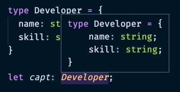

# TypeScript 1

> 인프런의 타입스크립트 입문 - 기초부터 실전까지 온라인 강의 학습 내용을 정리합니다

## ✅개발환경

- Chrome
- Visual Studio Code
- Node.js LTS버전 (v14.x 이상)
- Git

## ✅Typescript란?

> 자바스크립트에 타입을 부여한 언어

### Typescript의 특징

- 자바스크립트와 달리 브라우저에서 실행하려면 파일을 변환해주어야 함 => 이 과정을 *컴파일*이라고 부름
- 에러의 사전 방지와 코드 가이드 및 자동완성을 통해 코드의 품질과 개발 생산성을 높여준다

### 왜 Typescript를 공부하는지?

* 안정성이 높은 Typescript를 적용해 고객들에게 더 좋은 품질의 서비스를 제공하기 위해

- 많은 기업이 Javscript에서 안정적인 Typescript로 넘어가고 있는 추세
- Typescript에 대한 기초 지식, 향후 실무에서 사용하게 될 가능성이 크기때문에

## TIL

### 0626

* 기본 타입 : number, string, `Array<number>`,  object, boolean
  * object[], number[] : Array안에 들어가는 인자 타입 정의
  * void : 함수 return 값이 없을때 정의
* `?:` : 옵셔널 파라미터 => 넣어도 되고 안넣어도 되는 파라미터

* 인터페이스 : 타입 커스텀

### 0627

* 인터페이스

* 타입별칭 : 특정 타입이나 인터페이스를 참조할 수 있는 타입 변수
  * 별칭에 마우스를 대면 별칭이 그대로 보여져서 편리
  * 코드 가독성이 높아진다

* 인터페이스 vs 타입별칭 가장 큰 차이점: **확장 여부성**
  * 좋은 소프트웨어 원칙 - 확장가능성: 인터페이스로 선언하는것을 추천
  * 인터페이스 : 새로운 타입 생성 / 확장가능
  * 타입별칭 : 타입에 대한 별칭을 달아줌  / 확장안됨

