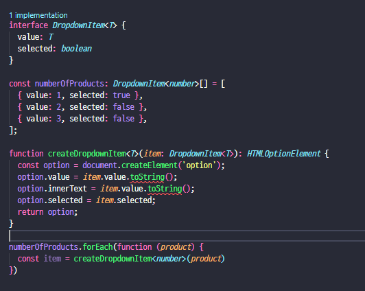

# TIL

## 0626

* 기본 타입 : number, string, `Array<number>`,  object, boolean, any
  * object[], number[] : Array안에 들어가는 인자 타입 정의
  * void : 함수 return 값이 없을때 정의
* `?:` : 옵셔널 파라미터 => 넣어도 되고 안넣어도 되는 파라미터

* 인터페이스 : 타입 커스텀


## 0627

* 인터페이스

* 타입별칭 : 특정 타입이나 인터페이스를 참조할 수 있는 타입 변수
  * 별칭에 마우스를 대면 별칭이 그대로 보여져서 편리
  * 코드 가독성이 높아진다

* 인터페이스 vs 타입별칭 가장 큰 차이점: **확장 여부성**
  * 좋은 소프트웨어 원칙 - 확장가능성: 인터페이스로 선언하는것을 추천
  * 인터페이스 : 새로운 타입 생성 / 확장가능
  * 타입별칭 : 타입에 대한 별칭을 달아줌  / 확장안됨


* 유니온타입, 인터섹션 타입
  * | (유니온타입) : A와 B 두가지 인터페이스를 유니온 타입으로 표현해 함수 파라미터에 적용하면 공통적인 속성만 함수에서 표현가능(나머지 속성은 타입오류), 함수 인자에는 A or B로만 표현해서 넣을 수 있다
  * & (인터섹션타입) : A와 B 인터섹션으로 표현해 함수 파라미터에 적용하면 합집합된 인자들 표현가능, 다만 함수 인자에도 합집합된 변수들을 넣어주어야한다

* 유니온 타입을 사용할 경우 타입가드 사용가능
  * 특정 타입으로 타입의 범위를 좁혀나가는 과정 


## 0628

* enum : 특정 값들의 집합

  * 숫자형 이넘

    ```
    enum Shoes {
        Nike,
        Adidas
    }
    ```

    

  * 문자형 이넘

    ```
    enum Shoes2 {
        Nike = '나이키',
        Adidas = '아디다스'
    }
    ```

    

* class

  * 생성자함수로 변환됨 (function)
  * 확장가능


## 0702

* *제너릭 : 클래스 또는 함수에서 사용할 타입(Type)을, 그 클래스나 함수를 사용할 때 결정하는 프로그래밍 기법

  * 장점 

    1. 함수 중복 선언을 막아 코드의 가독성과 유지보스 측면에서 좋다

    2. 타입에 무엇이 들어갈 것인지 유동적으로 정의 가능

    3. 유니온 타입은 공통된 동작에 대한 타입 안정성을 제공하며, 해당 타입들이 공유하는 내장 함수만 사용할 수 있습니다. 제너릭은 타입 제한을 통해 특정 타입이 가져야 하는 속성이나 메서드를 지정하여 해당 타입의 내장 함수를 사용할 수 있습니다.

       ```ts
       function doSomething<T extends { toString(): string }>(value: T): void {
         const str = value.toString();
         console.log(str);
       }
       ```

* 제너릭 오류 및 해결법

  * 유니온 사용 안하고 제너릭으로 사용하게 됐을 시 toString에서 Property 'toString' does not exist on type 'T'라는 오류발생

  

  

  * 해결방법

    1. if문 사용

       ```
       function createDropdownItem<T>(item: DropdownItem<T>): HTMLOptionElement {
         const option = document.createElement('option');
         if (typeof item.value === 'number') {
           option.value = item.value.toString();
           option.innerText = item.value.toString();
         }
         option.selected = item.selected;
         return option;
       }
       ```

       

    2. 타입 제한

       toString이라는 함수 메소드를 가진 타입만 제네릭으로 받는다고 명시할 수 있다

       ```typescript
       interface FuncitonType {
       	toString(): string
       }
       
       
       function createDropdownItem<T extends FunctionType>(item: DropdownItem<T>): HTMLOptionElement {
         const option = document.createElement('option');
         option.value = item.value.toString();
         option.innerText = item.value.toString();
         option.selected = item.selected;
         return option;
       }
       ```

       

* 제너릭 타입제한2 - 타입제한 (정의된 타입 이용하기)

  ```typescript
  // 제네릭 타입 제한 2 - 정의된 타입 이용하기
  interface LengthType {
      length: number;
  }
   
  // 인터페이스가 가진 하위 타입을 가지는 것들을 입력받는다고 명시함
  function logTextLength<T extends LengthType>(text: T): T {
      text.length;
      return text;
  }
   
  logTextLength('a'); // string.length
  logTextLength([1, 2, 3]) // array.length
  logTextLength({ length: 10 }) // 하위 속성으로 length 가지고 있기 때문에 입력 가능
  logTextLength(10); // 오류 : number.length 없음
  ```

  

* 제너릭 타입제한3 - keyof

  keyof를 사용하면 keyof다음에 오는 인터페이스가 가진 키들만 입력 받게 된다

  ```typescript
  // 3가지중 한개만 받겠다 제약
  interface ShoppingItem {
      name: string;
      price: number;
      stock: number;
  }
  
  // ShoppingItem이 가진 key들중 한가지가 type이 된다
  function getShoppingItemOPtion<T extends keyof ShoppingItem>(itemOption: T): T {
      let item: ShoppingItem = {
          name: "tumbler",
          price: 12000,
          stock: 10
        }
        console.log(item[itemOption]);
      return itemOption
  }
  
  console.log(getShoppingItemOPtion("name"))
  console.log(getShoppingItemOPtion("price"))
  console.log(getShoppingItemOPtion("stock"))
  ```

  

  

## 0703

* 이전까지 배운 내용 바탕으로 과제 진행

* Promise를 return할 시 Promise<반환타입>으로 타입을 정의해준다

  ```typescript
  function fetchContacts(): Promise<Contact[]> {
    const contacts: Contact[] = [
      {
        name: 'Tony',
        address: 'Malibu',
        phones: {
          home: {
            num: 11122223333,
          },
          office: {
            num: 44455556666,
          },
        },
      },
      ...
    ];
    return new Promise(resolve => {
      setTimeout(() => resolve(contacts), 2000);
    });
  }
  ```

  

* 실제 서비스 개발 시 더 명확한 개발을 위해서 enum사용

  * phoneType에 들어갈 수 있는 변수가 home, office, studio인데 입력 시 오타를 낼 수 있기 때문에 명확한 선언을 하기위해 enum 설정

  ```typescript
  interface PhoneNumberDictionary {
    [phone: string]: {
      num: number;
    };
  }
  
  interface Contact {
    name: string;
    address: string;
    phones: PhoneNumberDictionary;
  }
  enum PhoneType {
    Hoem = 'home', 
    Office = 'office',
    Studio = 'studio'
  }
  
  findContactByPhone(phoneNumber: number, phoneType: PhoneType): Contact[] {
      return this.contacts.filter(
      	contact => contact.phones[phoneType].num === phoneNumber
      );
  }
  ```

  

  

## 0704

* 타입추론  : TLS(Typescript Language Server)을 이용해 타입이 무엇인지 추론한다

  * Best Common Type : 가장 적합한 타입을 추론해준다

    ```typescript
    // let arr: (string | number | boolean)[]
    let arr = [1, 2, true, true, 'a']
    ```

    

* 타입 단언 (as) : 추론된 타입이 아닌 프로그래머가 원하는 타입을 할당

  ```ts
  // 1. div는 HTMLDivElement or null
  let div = document.querySelector('div');
  if (div) {
      div.innerText
  }
  
  
  // 2. 변경
  let div2 = document.querySelector('.container') as HTMLDivElement;
  div2.innerText // OK
  ```

  

* 타입 가드 : 타입 좁히기를 유발하는 표현

  * 제어흐름분석 (if, switch, typeof, in, instanceof)..

  * 사용자정의 타입가드(is)

    ```ts
    interface Developer {
        name: string;
        skill: string;
    }
    
    interface Person {
        name: string;
        age: number
    }
    
    function isDeveloper(target: Developer | Person): target is Developer {
        return (target as Developer).skill !== undefined;
    }
    
    // 만약 Developer라면 skill출력
    if (isDeveloper(tony)) {
        console.log(tony.skill)
    } else { // 아니라면 나이 출력
        console.log(tony.age)
    }
    ```

    

